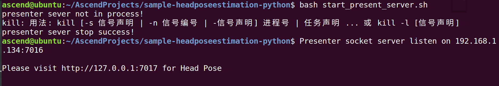

# 头部姿势识别（Python）<a name="ZH-CN_TOPIC_0220068404"></a>

开发者将本应用部署至Atlas 200 DK或者AI加速云服务器上实现对本地mp4文件或者RTSP视频流进行解码，对视频帧中的人脸图像进行头部姿势估计，并将预测的结果信息发送至Presenter Server端进行展示。

## 前提条件<a name="zh-cn_topic_0220049620_section137245294533"></a>

部署此Sample前，需要准备好以下环境：

-   已完成Mind Studio的安装。

-   已完成Atlas 200 DK开发者板与Mind Studio的连接，SD卡的制作、编译环境的配置等。
-   由于需要配置开发板联网，默认设置为USB连接，开发板地址为192.168.1.2

## 软件准备<a name="zh-cn_topic_0220049620_section8534138124114"></a>

运行此应用前，需要按照此章节进行相关的环境配置并获取源码包。

1.  <a name="zh-cn_topic_0220049620_li953280133816"></a>获取源码包。

    将[https://gitee.com/Atlas200DK/sample-headposeestimation-python](https://gitee.com/Atlas200DK/sample-headposeestimation-python)仓中的代码以Mind Studio安装用户下载至Mind Studio所在Ubuntu服务器的任意目录，例如代码存放路径为：$HOME/sample-headposeestimation-python。

2.  <a name="zh-cn_topic_0220049620_li12291771229"></a>获取此应用中所需要的网络模型。

    参考[表 头部姿势识别\(python\)使用模型](#zh-cn_topic_0220049620_table1119094515272)获取此应用中所用到的原始网络模型及其对应的权重文件，并将其存放到Mind Studio所在Ubuntu服务器的任意目录，例如：$HOME/ascend/models/headposeestimation-python。

    **表 1**  头部姿势识别\(python\)使用模型

    <a name="zh-cn_topic_0220049620_table1119094515272"></a>
    <table><thead align="left"><tr id="zh-cn_topic_0220049620_row677354502719"><th class="cellrowborder" valign="top" width="12.85%" id="mcps1.2.4.1.1"><p id="zh-cn_topic_0220049620_p167731845122717"><a name="zh-cn_topic_0220049620_p167731845122717"></a><a name="zh-cn_topic_0220049620_p167731845122717"></a>模型名称</p>
    </th>
    <th class="cellrowborder" valign="top" width="12.04%" id="mcps1.2.4.1.2"><p id="zh-cn_topic_0220049620_p277317459276"><a name="zh-cn_topic_0220049620_p277317459276"></a><a name="zh-cn_topic_0220049620_p277317459276"></a>模型说明</p>
    </th>
    <th class="cellrowborder" valign="top" width="75.11%" id="mcps1.2.4.1.3"><p id="zh-cn_topic_0220049620_p9773114512270"><a name="zh-cn_topic_0220049620_p9773114512270"></a><a name="zh-cn_topic_0220049620_p9773114512270"></a>模型下载路径</p>
    </th>
    </tr>
    </thead>
    <tbody><tr id="zh-cn_topic_0220049620_row3122314144215"><td class="cellrowborder" valign="top" width="12.85%" headers="mcps1.2.4.1.1 "><p id="zh-cn_topic_0220049620_p7118189378"><a name="zh-cn_topic_0220049620_p7118189378"></a><a name="zh-cn_topic_0220049620_p7118189378"></a>face_detection</p>
    </td>
    <td class="cellrowborder" valign="top" width="12.04%" headers="mcps1.2.4.1.2 "><p id="zh-cn_topic_0220049620_p151818183718"><a name="zh-cn_topic_0220049620_p151818183718"></a><a name="zh-cn_topic_0220049620_p151818183718"></a>人脸检测网络模型。</p>
    <p id="zh-cn_topic_0220049620_p11121816373"><a name="zh-cn_topic_0220049620_p11121816373"></a><a name="zh-cn_topic_0220049620_p11121816373"></a>此模型是基于Caffe的Resnet10-SSD300模型转换后的网络模型。</p>
    </td>
    <td class="cellrowborder" valign="top" width="75.11%" headers="mcps1.2.4.1.3 "><p id="zh-cn_topic_0220049620_p611318163718"><a name="zh-cn_topic_0220049620_p611318163718"></a><a name="zh-cn_topic_0220049620_p611318163718"></a>请参考<a href="https://gitee.com/HuaweiAscend/models/tree/master/computer_vision/object_detect/face_detection" target="_blank" rel="noopener noreferrer">https://gitee.com/HuaweiAscend/models/tree/master/computer_vision/object_detect/face_detection</a>目录中README.md下载原始网络模型文件及其对应的权重文件。</p>
    </td>
    </tr>
    <tr id="zh-cn_topic_0220049620_row1517495918114"><td class="cellrowborder" valign="top" width="12.85%" headers="mcps1.2.4.1.1 "><p id="zh-cn_topic_0220049620_p16541181214"><a name="zh-cn_topic_0220049620_p16541181214"></a><a name="zh-cn_topic_0220049620_p16541181214"></a>head_pose_estimation</p>
    </td>
    <td class="cellrowborder" valign="top" width="12.04%" headers="mcps1.2.4.1.2 "><p id="zh-cn_topic_0220049620_p175415131212"><a name="zh-cn_topic_0220049620_p175415131212"></a><a name="zh-cn_topic_0220049620_p175415131212"></a>头部姿势估计网络模型。此模型是基于Caffe的VGG-SSD模型转换后的网络模型</p>
    </td>
    <td class="cellrowborder" valign="top" width="75.11%" headers="mcps1.2.4.1.3 "><p id="zh-cn_topic_0220049620_p192971113151219"><a name="zh-cn_topic_0220049620_p192971113151219"></a><a name="zh-cn_topic_0220049620_p192971113151219"></a>请参考<a href="https://gitee.com/HuaweiAscend/models/tree/master/computer_vision/object_detect/head_pose_estimation" target="_blank" rel="noopener noreferrer">https://gitee.com/HuaweiAscend/models/tree/master/computer_vision/object_detect/head_pose_estimation</a>目录中README.md下载原始网络模型文件及其对应的权重文件。</p>
    </td>
    </tr>
    </tbody>
    </table>

3.  将原始网络模型转换为适配昇腾AI处理器的模型。
    1.  在Mind Studio操作界面的顶部菜单栏中选择“Tool \> Convert Model”，进入模型转换界面。
    2.  在弹出的**Convert Model**操作界面中，Model File与Weight File分别选择[步骤2](#zh-cn_topic_0220049620_li12291771229)中下载的模型文件和权重文件。
        -   **Model Name**填写为[表 检测网络应用\(python\)使用模型](#zh-cn_topic_0220049620_table1119094515272)对应的**模型名称**。
        -   face\_detection和head\_pose\_estimation模型都需要在AIPP配置界面将**Input Image Format**修改为RGB888\_U8，**Model Image Format**关闭。
        -   其他保持默认值。
        -   face\_detection模型在转换时会失败，报错如[图 face\_detection模型转换失败](#zh-cn_topic_0220049620_fig149226521166)所示。

            **图 1**  face\_detection模型转换失败<a name="zh-cn_topic_0220049620_fig149226521166"></a>  
            

            此时在**DetectionOutput**层的**Suggestion**中选择**SSDDetectionOutput**，并点击**Retry**。

    3.  单击OK开始转换模型。

        1.1.0.0和1.3.0.0版本模型转换成功后，后缀为.om的离线模型存放地址为：**$HOME/tools/che/model-zoo/my-model/xxx**。

        1.31.0.0及以上版本模型转换成功后，后缀为.om的离线模型存放地址为：**$HOME/modelzoo/xxx/device/xxx.om**。

    4.  将转换好的模型文件（.om文件）上传到[步骤1](#zh-cn_topic_0220049620_li953280133816)中源码所在路径下的“sample-headposeestimation-python/model”目录下。

4.  以Mind Studio安装用户登录Mind Studio所在Ubuntu服务器，并设置环境变量DDK\_HOME。

    **vim \~/.bashrc**

    1.  1.3.0.0版本执行如下命令在最后一行添加DDK\_HOME及LD\_LIBRARY\_PATH的环境变量。

        **export DDK\_HOME=$HOME/tools/che/ddk/ddk**

        **export LD\_LIBRARY\_PATH=$DDK\_HOME/uihost/lib**

    2.  1.31.0.0及以上版本执行如下命令在最后一行添加环境变量

        **export tools\_version=_1.31.X.X_**

        **export DDK\_HOME=\\$HOME/.mindstudio/huawei/ddk/\\$tools\_version/ddk**

        **export NPU\_DEVICE\_LIB=$DDK\_HOME/../RC/host-aarch64\_Ubuntu16.04.3/lib**

        **export LD\_LIBRARY\_PATH=\\$DDK\_HOME/lib/x86\_64-linux-gcc5.4:\\$DDK\_HOME/uihost/lib**

    > **说明：**    
    >-   1.31.0.0及以上版本环境变量设置时1.31.X.X为DDK版本号，可以通过安装的DDK的包名获取，如DDK包的包名为Ascend\_DDK-1.31.T15.B150-1.1.1-x86\_64.ubuntu16.04.tar.gz，则此DDK的版本号为1.31.T15.B150。  
    >-   如果此环境变量已经添加，则此步骤可跳过。  

    输入:wq!保存退出。

    执行如下命令使环境变量生效。

    **source \~/.bashrc**


## 环境配置<a name="zh-cn_topic_0220049620_section1759513564117"></a>

**注：开发板上hiai库、opencv库、相关依赖已安装可跳过此步骤**

1.  配置开发板联网。
    1.  不断开usb连接的情况下，开发板通过网线与可以上网的网口相连。
    2.  在Mind Studio所在Ubuntu服务器中，以HwHiAiUser用户SSH登录到Host侧。

        **ssh HwHiAiUser@192.168.1.2**

        切换到root用户，开发板中root用户默认密码为**Mind@123**。

        **su root**

        打开interfaces配置文件。

        **vim /etc/network/interfaces**

        配置dhcp，把eth0的配置修改为如下两行。

        **auto eth0**

        **iface eth0 inet dhcp**

        如[图 开发板interface文件配置](#zh-cn_topic_0220049620_fig151021334153812)所示，输入:wq!保存退出。

        **图 2**  开发板interface文件配置<a name="zh-cn_topic_0220049620_fig151021334153812"></a>  
        

    3.  执行以下命令重启开发板，使配置生效。

        **reboot**

    4.  等开发板四个灯常亮时则证明已经完成重启，此时可以ping外网验证网络是否通畅，如果ping通则已经配置成功；如果ping失败，则执行以下命令。成功后如[图 开发板联网配置成功](#zh-cn_topic_0220049620_fig4366141165015)所示。

        **ifdown eth0**

        **ifup eth0**

        **图 3**  开发板联网配置成功<a name="zh-cn_topic_0220049620_fig4366141165015"></a>  
        

2.  安装环境依赖。
    1.  在开发板的root用户下更换源。

        **vim /etc/apt/sources.list**

        把原有源更换为arm源，可用的国内arm源有中科大源和清华源等。

        > **说明：**   
        >arm源可参考[https://bbs.huaweicloud.com/forum/thread-37023-1-1.html](https://bbs.huaweicloud.com/forum/thread-37023-1-1.html)。  

        源更新后，执行以下命令更新软件列表。

        **apt-get update**

    2.  安装相关依赖。

        ```
        apt-get install python-setuptools python-dev build-essential python-pip 
        ```

        ```
        pip install numpy==1.11.2 enum34==1.1.6 future==0.17.1 funcsigs==1.0.2 enum future unique enum34 funcsigs protobuf
        ```

        > **说明：**   
        >pip install安装有报错“SSLError”时，请使用：pip install --trusted-host pypi.org --trusted-host files.pythonhosted.org numpy==1.11.2 enum34==1.1.6 future==0.17.1 funcsigs==1.0.2 enum future unique enum34 funcsigs protobuf 安装依赖，表示可信赖的主机解决问题。  

    3.  安装hiai。

        执行脚本安装hiai，hiai的安装脚本可以在码云的tools仓中获取，将脚本内容复制到开发板中。

        安装脚本路径：[https://gitee.com/HuaweiAscend/tools/blob/master/python2\_hiai\_install.sh](https://gitee.com/HuaweiAscend/tools/blob/master/python2_hiai_install.sh)。

        在开发板的root用户下执行脚本进行hiai库安装：

        **bash python2\_hiai\_install.sh**

        安装后如[图 hiai安装成功验证](#zh-cn_topic_0220049620_fig89761216122414)所示，则为安装成功。

        **图 4**  hiai安装成功验证<a name="zh-cn_topic_0220049620_fig89761216122414"></a>  
        

3.  安装opencv。

    root用户下安装opencv Python库。

    命令示例：

    **apt-get install python-opencv**

    安装后如[图 opencv安装成功验证](#zh-cn_topic_0220049620_fig1478418313328)所示，则为安装成功。

    **图 5**  opencv安装成功验证<a name="zh-cn_topic_0220049620_fig1478418313328"></a>  
    


## 部署<a name="zh-cn_topic_0220049620_section1872516528910"></a>

1.  以Mind Studio安装用户进入headposeestimation-python应用代码所在根目录，如：$HOME/sample-headposeestimation-python。
2.  <a name="zh-cn_topic_0220049620_li9634105881418"></a>执行部署脚本，进行工程环境准备，Presenter Server服务器的配置等操作，其中Presenter Server用于接收Application发送过来的数据并通过浏览器进行结果展示。

    **bash deploy.sh** _host\_ip_

    -   _host\_ip_：Atlas 200 DK开发者板的IP地址。

    命令示例：

    **bash deploy.sh 192.168.1.2**

    当提示“Please choose one to show the presenter in browser\(default: 127.0.0.1\):“时，请输入在浏览器中访问Presenter Server服务所使用的IP地址（一般为访问Mind Studio的IP地址。）

    请在“Current environment valid ip list“中选择通过浏览器访问Presenter Server服务使用的IP地址。

3.  <a name="zh-cn_topic_0220049620_li156931456596"></a>启动Presenter Server。

    执行如下命令在后台启动Head Poseestimation应用的Presenter Server主程序。

    **bash start\_presenterserver.sh**

    > **说明：**   
    >执行此脚本会先杀死后台的其他Presenter Server进程。后台无正在执行的进程会提示presenter server not in process；后台有正在执行的进程会提示presenter server stop success。  

    如[图 Presenter Server进程启动](#zh-cn_topic_0220049620_fig69531305324)所示，表示presenter\_server的服务启动成功。

    **图 6**  Presenter Server进程启动<a name="zh-cn_topic_0220049620_fig69531305324"></a>  
    

    使用上图提示的URL登录Presenter Server，仅支持Chrome浏览器。IP地址为[步骤2](#zh-cn_topic_0220049620_li9634105881418)中输入的IP地址，端口号默为7007，如下图所示，表示Presenter Server启动成功。

    **图 7**  主页显示<a name="zh-cn_topic_0220049620_fig64391558352"></a>  
    

    Presenter Server、Mind Studio与Atlas 200 DK之间通信使用的IP地址示例如下图所示：

    **图 8**  IP地址示例<a name="zh-cn_topic_0220049620_fig1881532172010"></a>  
    

    其中：

    -   Atlas 200 DK开发者板使用的IP地址为192.168.1.2（USB方式连接）。
    -   Presenter Server与Atlas 200 DK通信的IP地址为UI Host服务器中与Atlas 200 DK在同一网段的IP地址，例如：192.168.1.223。
    -   通过浏览器访问Presenter Server的IP地址本示例为：10.10.0.1，由于Presenter Server与Mind Studio部署在同一服务器，此IP地址也为通过浏览器访问Mind Studio的IP。

4.  headposeestimation-python应用支持解析本地视频和RTSP视频流。
    -   如果需要解析本地视频，需要将视频文件传到Host侧。

        例如将视频文件headpose.mp4上传到Host侧的“/home/HwHiAiUser/sample“目录下。

        > **说明：**   
        >支持H264与H265格式的MP4文件，如果MP4文件需要剪辑，建议使用开源工具ffmpeg，使用其他工具剪辑的视频文件ffmpeg工具可能不支持解析。  

    -   如果仅解析RTSP视频流，本步骤可跳过。


## 运行<a name="zh-cn_topic_0220049620_section6245151616426"></a>

1.  在Mind Studio所在Ubuntu服务器中，以HwHiAiUser用户SSH登录到Host侧。

    **ssh HwHiAiUser@192.168.1.2**

2.  在HwHiAiUser用户下进入分类网络应用代码所在目录。

    **cd \~/HIAI\_PROJECTS/headposeestimationapp**

3.  执行应用程序。

    **python main.py** _channel_

    -   channel: 输入的视频文件名或者RTSP流地址

    视频文件运行的命令示例如下所示：

    **python main.py /home/HwHiAiUser/sample/headpose.mp4**

    RTSP视频流的命令示例如下所示：

    **python main.py rtsp://192.168.2.37:554/cam/realmonitor?channel=1&subtype=0**

    > **说明：**   
    >可使用ctrl+c停止程序  

4.  使用启动Presenter Server服务时提示的URL登录 Presenter Server 网站，详细可参考[启动Presenter Server](#zh-cn_topic_0220049620_li156931456596)。

    等待Presenter Agent传输数据给服务端，单击“Refresh“刷新，当有数据时相应的Channel 的Status变成绿色，如[图 Presenter Server界面](#zh-cn_topic_0220049620_fig113691556202312)所示。

    **图 9**  Presenter Server界面<a name="zh-cn_topic_0220049620_fig113691556202312"></a>  
    

    > **说明：**   
    >-   Presenter Server最多支持10路Channel同时显示，每个  _presenter\_view\_app\_name_  对应一路Channel。  
    >-   由于硬件的限制，每一路支持的最大帧率是20fps，受限于网络带宽的影响，帧率会自动适配为较低的帧率进行展示。  

5.  单击右侧对应的View Name链接，比如上图的“video”，查看结果。

